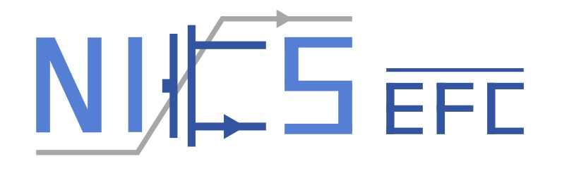

# MBQ: Modality-Balanced Quantization for Large Vision-Language Models [[paper]](https://arxiv.org/abs/2412.19509)

## Installation

1. Clone this repo
    ```bash
    git clone --recurse-submodules git@github.com:thu-nics/MBQ.git
    ```

2. Create a conda env
    ```bash
    conda create -n qmllm python=3.10
    ```

3. Install packages and 3rdparty repos.
    ```bash
    # Install LLaVA-NeXT
    cd ./3rdparty/LLaVA-NeXT
    pip install -e .

    # Install lmms-eval
    cd ./3rdparty/lmms-eval
    pip install -e .

    # Install qmllm
    pip install -r requirements.txt
    pip install -e .
    ```

## Apply model quantization in `qmllm` package
### Command-line Interface 

Quantization search for MLLMs is executed based on `main_quant.py`. A variety of arguments are available to configure the quantization search process. We also support using YAML files for parameter configuration, you can refer to [yaml configs](./configs) to directly use and adjust parameters, or create your own custom configuration.

1. Model arguments
    * `--model` : Select which model type is processed during quantization search. Must be a string corresponding to the name of the model type. 
        - only support `internvl2`, `llava_onevision`, `llava`, `qwen2_vl` now.
    * `--model_args` : Control parameters passed to the model constructor. Accepts a string containing model path", for example `--model_args pretrained=OpenGVLab/InternVL2-8B`.

2. Calibration arguments
    * `--calib_data` : Select which calibration data type is used during quantization search. 
        - only support `pileval` and `coco` now.
    * `--n_samples` : The number of the samples used in quantization search.
    * `--data_path` : Accept a string of the dataset path.
        - for `pileval` , we use `mit-han-lab/pile-val-backup`.
        - for `coco` , the data need to be a JSON or JSONL file, you can refer to [sharegpt4v](https://github.com/InternLM/InternLM-XComposer/blob/main/projects/ShareGPT4V/docs/Data.md#prepare-images) for data preparation.
    * `--image_folder` : Accept a string of the image folder, you can refer to [sharegpt4v](https://github.com/InternLM/InternLM-XComposer/blob/main/projects/ShareGPT4V/docs/Data.md#prepare-images) for data preparation.
    * `--few_shot_format` : Organize the calibration data in an interleaved format, currently by simply concatenating two samples.
        - this option is valid only when `--calib_data=coco`.
    * `--interleave_format` : Organize the calibration data with image-text pairs and pure text data, currently by simply insert 512 pure text token in two image-text pairs.
        - this option is valid only when `--calib_data=coco`.
    * `--text_data_path` : Accept a string of the pure text dataset path, this dataset will be used in interleave_format, we use `mit-han-lab/pile-val-backup`.

3. Quantization arguments
    * `--method` : Select the quantization search type, support `mbq` , `awq` , `smoothquant` and `rtn`.
    * `--run_process` : Specify this parameter to run the quantization search.
    * `--w_bit`: Specify the weight bit.
    * `--w_group`: Specify the group size in `weight-only per-group` quantization.
    * `--a_bit`: Specify the activation bit.
    * `--alpha`: The hyperparameter of Smoothquant.
    * `--reweight`: Specify this parameter to use gradient to reweight the loss during quantization search.
    * `--distort`: Specify this parameter to use distort feature map during quantization search.
    * `--loss_mode`: Select the loss type during quantization search, support `mae` , `mse`.
    * `--scale_path`: The path for saving quantization search results.
    * `--pseudo_quant`: Specify this parameter to perform pseudo quantization for the model.

### Run Quantization
* We support using YAML files for parameter configuration, you can use it as follows:
    ```bash
    python3 -W ignore main_quant.py \
        --config configs/internvl2/MBQ_search/8b_weight_only.yaml
    ```
* For quantization, you should specify `--run_process` in the command and provide the appropriate `data path` and `quantization config`.
* The quantization search results will be stored in `scale_path`, and we use the results to perform quantization.

1. Weight-only Quantization with MBQ
    ```bash
    python3 -W ignore main_quant.py \
        --model internvl2
        --model_args pretrained="OpenGVLab/InternVL2-8B" \
        --calib_data coco \
        --data_path "your/data/path/" \
        --image_folder "your/image/folder" \
        --n_samples 128 \
        --interleave_format \
        --method mbq \
        --run_process \
        --w_bit 4 \
        --w_group 128 \
        --reweight \
        --loss_mode mae \
        --scale_path "scale_cache/mbq/internvl2_w4g128.pt"
    ```
2. Weight-Activation Quantization with MBQ
    ```bash
    python3 -W ignore main_quant.py \
        --model internvl2
        --model_args pretrained="OpenGVLab/InternVL2-8B" \
        --calib_data coco \
        --data_path "your/data/path/" \
        --image_folder "your/image/folder" \
        --n_samples 128 \
        --method mbq \
        --run_process \
        --w_bit 4 \
        --a_bit 8 \
        --reweight \
        --distort \
        --loss_mode mae \
        --scale_path "scale_cache/mbq/internvl2_w4a8.pt"
    ```

### Run Evaluation
* We support using YAML files for parameter configuration, you can use it as follows:
    ```bash
    python3 -W ignore main.py \
        --config configs/internvl2/Eval/eval.yaml
    ```
* For evaluation, you should specify `--pseudo_quant` in the command and provide the appropriate `scale path` and `quantization config`.

1. Evaluation with weight-only quantization
    ```bash
    python3 -W ignore main.py \
        --model internvl2
        --model_args pretrained="OpenGVLab/InternVL2-8B" \
        --tasks mmmu \
        --batch_size 1 \
        --log_samples \ 
        --log_samples_suffix mmmu \
        --method mbq \
        --pseudo_quant \
        --w_bit 4 \
        --w_group 128 \
        --output_path "your/output/path" \
        --scale_path "scale_cache/mbq/internvl2_w4g128.pt"
    ```

2. Evaluation with weight-activation quantization
    ```bash
    python3 -W ignore main.py \
        --model internvl2
        --model_args pretrained="OpenGVLab/InternVL2-8B" \
        --tasks mmmu \
        --batch_size 1 \
        --log_samples \ 
        --log_samples_suffix mmmu \
        --method mbq \
        --pseudo_quant \
        --w_bit 4 \
        --a_bit 8 \
        --output_path "your/output/path" \
        --scale_path "scale_cache/mbq/internvl2_w4a8.pt"
    ```

## Citation
```
@misc{li2024mbq,
      title={MBQ: Modality-Balanced Quantization for Large Vision-Language Models}, 
      author={Shiyao Li and Yingchun Hu and Xuefei Ning and Xihui Liu and Ke Hong and Xiaotao Jia and Xiuhong Li and Yaqi Yan and Pei Ran and Guohao Dai and Shengen Yan and Huazhong Yang and Yu Wang},
      year={2024},
      eprint={2412.19509},
      archivePrefix={arXiv},
      primaryClass={cs.CV},
      url={https://arxiv.org/abs/2412.19509}, 
}
```

## Contact Us

* Shiyao Li: lishiyao20@mails.tsinghua.edu.cn
* Yingchun Hu: huych@buaa.edu.cn
* Xuefei Ning: foxdoraame@gmail.com
* Xiaotao Jia: jiaxt@buaa.edu.cn
* Yu Wang: yu-wang@tsinghua.edu.cn

This work is maintained by [NICS-EFC Lab](https://nicsefc.ee.tsinghua.edu.cn/) (Tsinghua University) and [Infinigence-AI](https://www.infini-ai.com/) (Beijing China).

<p align="middle">
  
  
</p>